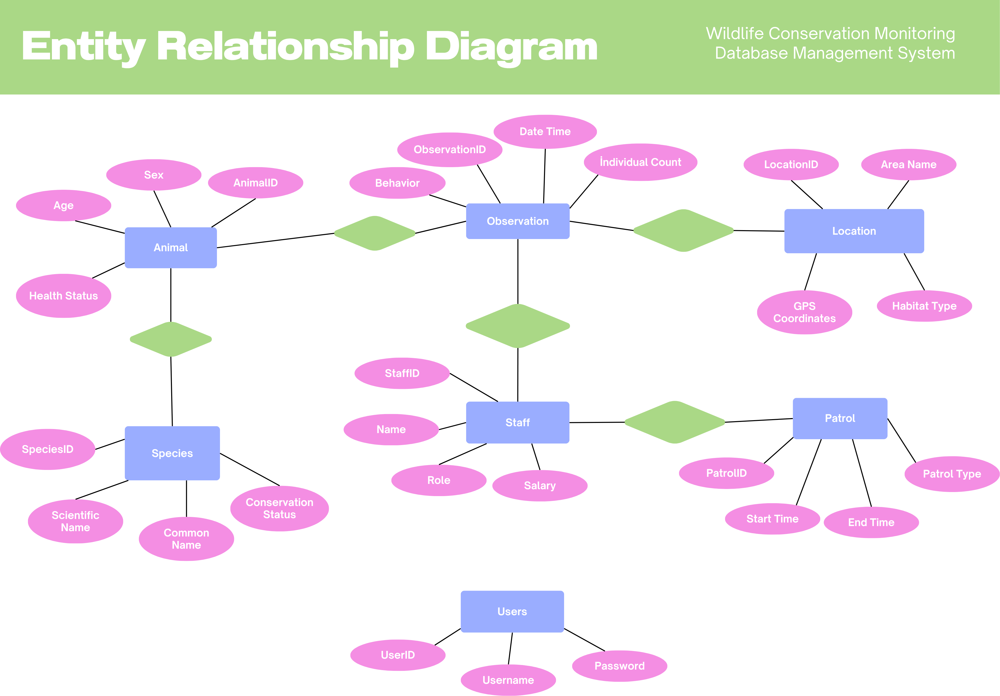

# CMPE344 Wildlife Conservation Monitoring Database Management System

## Project Members
- Mert Yorulmaz 22314700
- Furkan Uzun 22207964
- Umut Sevinç 22207663
- İzhar Baday 22208356

## Project Description
This project is a Wildlife Conservation Monitoring Database Management System developed for the CMPE344 course.  
The system is designed to manage wildlife species, patrol activities, observations, staff information, and conservation locations efficiently using a relational database structure.

## Technologies
- Postgres SQL , MySQL
- Supabase (Cloud Database)
- GitHub
- HTML
- CSS
- JAVASCRIPT

## Repository Structure
- ERD: ER Diagram
- DDL: Table creation
- DML: Insert, update, delete
- Queries: SQL queries
- Blocks: SQL blocks

## ER Diagram

## Data Definition Language (DDL)
The table creation operations can be found here:
➡️ [DDL](DDL/DDL.sql)

## Data Manupilation Language (DML)
Data manipulation operations can be found here:
➡️ [DML](DML/DML.sql)

## SQL Queries
SQL Queries can be found here:
➡️ [SQL QUERIES](SQL_Queries/SQL_Queries.sql)

## SQL Blocks
SQL Blocks can be found here:
➡️ [SQL QUERIES](SQL_Blocks/SQL_Blocks.sql)
